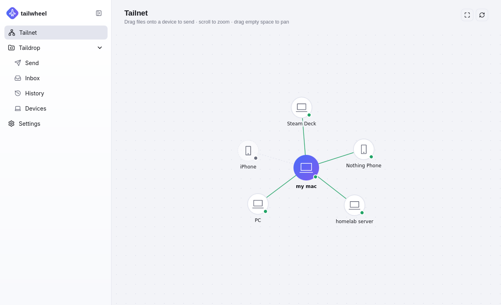

<div align="center">

[//]: # ()

# Tailwheel

**An unofficial desktop GUI and CLI for [Tailscale](https://tailscale.com) and [Taildrop](https://tailscale.com/docs/features/taildrop).**

See your tailnet, and send files between your own devices — with a confirmation step before
anything lands on your disk.

[](https://github.com/alexvice02/tailwheel/releases/latest)
[](https://ko-fi.com/alexvice02)
</div>

<div align="center"> 

</div>

---

> Not affiliated with Tailscale. Tailwheel drives the `tailscale` CLI that is already
> installed on your machine — it does not reimplement the transfer protocol, so it works
> with **any** device on your tailnet: phones, other operating systems, stock Tailscale
> clients.

## Features

**Tailnet map** — an interactive graph of every device on your tailnet. Zoom, pan, right-click
a node to copy its IP, or **drag files straight onto a device** to send them.

**Send files** — drag and drop onto the window, or use *Browse files* / *Browse folder*. Pick a
device from a live list (online/offline is visible before you try to send, not after). Folders
are expanded into their files automatically, since Taildrop can only transfer individual files.

**Inbox with Accept / Reject** — incoming files do **not** go straight to your downloads folder.
They wait in the Inbox until you confirm. Reject deletes the file without ever saving it to your
save directory. Auto-accept is available in Settings if you'd rather skip the prompt.

**"Who sent this?"** — Tailscale's own API exposes only a filename and a size, with no sender
identity. When both sides run Tailwheel, it sends a tiny metadata sidecar alongside the file so
the Inbox can say *"laptop-x sent you photo.jpg"*. Files from stock Tailscale clients still
arrive normally, just without a sender name.

**History** — every transfer sent and received: time, direction, device, size, and status
(Completed / Rejected / Failed). Optional automatic cleanup (daily / weekly / monthly / never).

**Devices** — every node in your tailnet with its OS, IP and online state, plus how many files
you've exchanged with each one.

**Tray + notifications** — closing the window hides Tailwheel to the system tray so it keeps
receiving in the background. You get an OS notification when a file arrives, even with the
window closed.

**CLI** — a `taildrop` binary that shares the same history, settings and pending queue as the
GUI (built from source for now, see [CLI usage](#cli-usage)).

## Requirements

Tailscale must be installed, running, and logged in. Taildrop also has to be enabled for your
tailnet — see [Tailscale's Taildrop docs](https://tailscale.com/kb/1106/taildrop).

Check that the CLI is reachable before reporting a problem:

```bash
tailscale status
```

## Install

Grab a build from the [**latest release**](https://github.com/alexvice02/tailwheel/releases/latest).

### Windows

| File | Notes |
| --- | --- |
| `tailwheel_<version>_x64-setup.exe` | NSIS installer — recommended |
| `tailwheel_<version>_x64_en-US.msi` | MSI, for deployment via Group Policy etc. |

The builds are unsigned, so SmartScreen will warn you: *More info → Run anyway*.

### Linux

| File | Install |
| --- | --- |
| `tailwheel_<version>_amd64.AppImage` | `chmod +x tailwheel_*.AppImage && ./tailwheel_*.AppImage` |
| `tailwheel_<version>_amd64.deb` | `sudo apt install ./tailwheel_*.deb` |
| `tailwheel-<version>-1.x86_64.rpm` | `sudo dnf install ./tailwheel-*.rpm` |

x86_64 only for now. Both X11 and Wayland work; on a tiling WM you may want
*Settings → Experimental → Hide the native window title bar*.

### macOS

No prebuilt binary yet — [build from source](#building-from-source). It is supported, just not
released.

## Settings

- **Save received files to** — where accepted files end up. Defaults to `~/Downloads`.
- **Auto-accept incoming files** — save immediately, skipping the Inbox confirmation.
- **If a file with the same name already exists** — keep both (rename), overwrite, or skip.
- **Check for new files every (seconds)** — how often the inbox is polled.
- **Automatically clear old transfer history** — daily / weekly / monthly / never.

## CLI usage

`taildrop` is not included in the installers yet — build it with
`cargo build --release -p taildrop-cli` (the binary lands in `target/release/taildrop`). It reads
and writes the same history, settings and pending queue as the GUI, so you can accept a file from
the terminal that you can see in the window.

```bash
taildrop send <device> <file>...     # send one or more files to a peer
taildrop status                      # tailnet devices + per-device transfer stats

taildrop confirm-drop list           # what's waiting for confirmation
taildrop confirm-drop accept <id>    # accept one file (an unambiguous id prefix is enough)
taildrop confirm-drop reject <id>    # reject and delete one file
taildrop confirm-drop accept-all     # accept everything pending
```

## Where your data lives

Plain JSON in the standard app-data directory for your OS — `~/.local/share/tailwheel` on
Linux, `%APPDATA%\tailwheel` on Windows, `~/Library/Application Support/tailwheel` on macOS:

- `settings.json`, `history.json`, `pending.json`
- `staging/` — files that arrived but haven't been accepted yet
- `tailwheel.log` — a timing log of every `tailscale` invocation. **Attach this if you report
  that the app feels slow.**

Nothing is sent anywhere except directly to the device you choose, peer-to-peer over
Tailscale. There is no server in the middle and no telemetry.

## Known limitations

- **Files, not folders.** Taildrop transfers individual files; a folder you drop is expanded
  into its files, without the directory structure.
- **No preview before accepting.** Tailscale gives no way to inspect its inbox without
  consuming it, so Tailwheel moves incoming files into its own staging directory first. That is
  exactly what makes a Reject button possible, but it means you see a name and a size, not
  contents.
- **Sender name only between Tailwheel users** — see [Features](#features).

## Building from source

Needs [Node.js](https://nodejs.org), [Rust](https://rustup.rs), and the
[Tauri prerequisites](https://tauri.app/start/prerequisites/) for your platform. On Debian/Ubuntu
that's `libwebkit2gtk-4.1-dev`, `libayatana-appindicator3-dev`, `librsvg2-dev`, `libxdo-dev`,
`libssl-dev` and `build-essential`.

```bash
npm install
npm run tauri dev          # run it
npm run tauri build        # installers into src-tauri/target/release/bundle/

cargo build -p taildrop-cli   # just the CLI
cargo test -p taildrop-core   # tests
```

Rust workspace: `crates/taildrop-core` (shared logic, used verbatim by both frontends),
`crates/taildrop-cli` (the `taildrop` binary), `src-tauri` (Tauri backend). Frontend is Vue 3 +
Vite in `src/`.


Bug reports and feature requests are welcome in
[Issues](https://github.com/alexvice02/tailwheel/issues).

<div align="center">

## Support

If Tailwheel is useful to you, you can

[](https://ko-fi.com/R5U5247L0S)

</div>